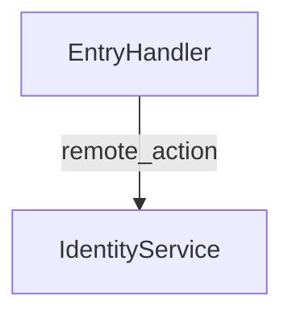

<div align="center">

# 🧭 `@saptools/service-flow`

**Trace SAP CAP service-to-service flows across multi-repository TypeScript workspaces.**

Index independent Git repositories, persist CAP/CDS facts in SQLite, resolve cross-repo service calls, and explain one operation end-to-end through handlers, helper packages, local database access, remote OData calls, external HTTP calls, and async channels — without running the applications.

[](https://www.npmjs.com/package/@saptools/service-flow)
[](./LICENSE)
[](https://nodejs.org)
[](https://packagephobia.com/result?p=@saptools/service-flow)
[](https://www.typescriptlang.org)

[Install](#-install) • [Quick Start](#-quick-start) • [CLI](#-cli) • [FAQ](#-faq)

</div>

---

## ✨ Features

- 🧭 **Cross-repository CAP tracing** — starts from a repo, service, operation path, operation name, or handler and follows the indexed flow across workspace boundaries
- 🧩 **Static CAP/CDS indexing** — extracts services, actions, functions, events, handler classes, decorator metadata, handler registrations, executable symbols, local helper calls, and package-level `cds.requires`
- 🔗 **Service-to-service linking** — resolves `cds.connect.to(...)`, `remote.send(...)`, `cds.services.*` style calls, helper package imports, dynamic candidates, and unresolved evidence into graph edges
- 🗄️ **SQLite-backed workspace cache** — stores deterministic facts under `.service-flow/service-flow.db` so large workspaces can be queried repeatedly without reparsing everything
- 🧠 **Dynamic edge support** — preserves parameterized destinations and service paths such as `svc_${objectCode}_process`, then lets trace and graph commands apply runtime `--var key=value` values that can turn dynamic candidates into effective traversable operation edges
- 📊 **Multiple output modes** — renders human-readable tables, JSON for automation, and Mermaid diagrams for architecture docs
- 🩺 **Diagnostics-first workflow** — records parse/index issues and exposes them through `service-flow doctor` instead of hiding partial analysis
- 🧩 **CAP helper-aware binding evidence** — follows imported helpers exported directly or through named export lists and separates alias, destination, and service-path expressions for dynamic `cds.connect.to(alias, options)` calls
- 🧭 **Nested workspace discovery** — scans nested repositories even when the selected root is itself a valid Git repository, while ignoring empty `.git` placeholders
- 🔐 **Secret-aware summaries** — redacts sensitive keys in persisted summaries and CLI output while keeping useful source evidence
- 📦 **Standalone CLI & typed package** — ships as an npm CLI with TypeScript definitions for integration into other saptools workflows

---

## 📦 Install

```bash
# Global CLI
npm install -g @saptools/service-flow

# Or as a dependency
npm install @saptools/service-flow
# pnpm add @saptools/service-flow
# yarn add @saptools/service-flow
```

> [!NOTE]
> Requires **Node.js ≥ 24.0.0** for the bundled `node:sqlite` runtime. The CLI uses a persistent SQLite driver (`node:sqlite` in supported Node builds) for bound parameters, transactions, WAL, busy timeouts, and read-only query commands. The analyzer is static: it reads files and package metadata, but it does not start CAP services, connect to SAP BTP, or execute application code.

---


### Correctness notes

- Runtime `--var` values are considered only for dynamic, ambiguous, or unresolved **remote** graph edges whose alias, destination, service path, or operation path expressions contain supplied placeholders. Placeholder keys are the full trimmed expression inside `${...}`, so keys such as `domainInfo.serviceName`, `domainInfo.shortName?.toLowerCase()`, and `items[0].service` can be supplied literally without JavaScript evaluation. Local database, external HTTP, event, and already resolved static edges keep their persisted status, target, reason, and confidence. Partial substitutions remain dynamic and report the missing placeholder names.
- `trace` and `graph` both accept repeatable `--var key=value` options. Effective substitutions are rendered in trace evidence without mutating the persisted graph. Confidence values are bounded to `[0, 1]`.
- Repository selectors on list, trace, graph, and inspect commands narrow scope. Unknown selectors return empty machine-readable diagnostics instead of falling back to the whole workspace.
- Helper-package dependency edges prefer exact indexed package names. Duplicate package-name candidates are persisted as ambiguous evidence rather than silently selecting one repository.
- Handler registration parsing is AST-based for common `createCombinedHandler({ handler: ... })` forms: direct arrays, arrays assembled with spreads, non-`handlers` array names, aliased class imports, default-imported arrays, named exported arrays, and safe relative re-exports. Class-level rows keep registration file/line and import evidence.
- Implementation edges require both operation compatibility and registration evidence. Decorator operation signals are stronger than method-name fallback; common generated names such as `FuncGetConfiguration` and `ActionGetConfiguration` are normalized before comparison, and a contradictory decorator rejects the candidate even when the TypeScript method name collides. Same-repository registrations do not need a self-dependency edge; cross-package matches use registration or handler-package dependencies on the model package. Duplicate strong candidates are stored as ambiguous implementation edges.
- Traces render persisted `OPERATION_IMPLEMENTED_BY_HANDLER` hops after static or runtime remote operation resolution, including terminal handler nodes and ambiguous or unresolved implementation evidence when traversal cannot continue.
- Repository fingerprints include source content, package name/version, dependencies and devDependencies, scripts, normalized `cds.requires` (including nested credentials), package file content, and the analyzer version. Metadata-only changes therefore trigger reindexing.
- Index publication is designed around the last-good snapshot: failed parse or persistence attempts are recorded as diagnostics and must not be mixed with older graph facts. After indexing changes, relink before relying on graph/trace output; doctor reports stale or inconsistent stores where detectable.
- Source discovery, file reads, hashing, parsing, and publication are all inside the repository-level protected indexing flow. A failed read keeps the previous fingerprint and facts, marks the repository failed, and records a `source_read_failed` diagnostic; a later successful index clears superseded read-failure diagnostics during fact publication.
- Normal successful database commands on supported Node 24 runtimes suppress the known `node:sqlite` experimental warning so JSON stdout remains parseable and stderr-clean. Real service-flow errors still use stderr and non-zero exit codes.
- Doctor treats a `running` index run as abandoned only after 60 minutes and includes the run id/start time. Active short-lived concurrent runs are not default warnings.
- Fresh databases include foreign keys for key graph, run, and diagnostic tables. Migrated legacy stores that still lack that metadata are reported by doctor with `legacy_schema_weaker_foreign_keys`; rebuild into a fresh database if strict structural parity is required.
- Parser warnings describe analysis completeness, while routing status describes graph behavior. A terminal DB edge can remain terminal while still exposing parser warning evidence about an unknown entity.


## 🚀 Quick Start

```bash
# 1. Initialize a workspace that contains many CAP/helper Git repositories
service-flow init /path/to/workspace

# 2. Index source facts from every discovered repository
service-flow index --workspace /path/to/workspace

# 3. Resolve cross-repository edges after all repos have been indexed
service-flow link --workspace /path/to/workspace

# 4. Trace one operation as a readable table
service-flow trace --workspace /path/to/workspace --repo facade-service --operation doWork

# 5. Generate a Mermaid diagram for documentation
service-flow graph --workspace /path/to/workspace --service /FacadeService --path /doWork --format mermaid

# 6. Check parse/index diagnostics
service-flow doctor --workspace /path/to/workspace
```

After `init`, the workspace configuration and SQLite database live below the selected workspace by default. Run `index` whenever source changes; unchanged repositories are skipped unless `--force` is supplied. Then run `link` to rebuild the graph edges used by `trace` and `graph`.

---

## 🧰 CLI

### 🏁 `service-flow init <workspace>`

Discover nested Git repositories, create workspace state, save configuration, and record repository metadata.

```bash
service-flow init /path/to/workspace
service-flow init /path/to/workspace --db /custom/path/service-flow.db
service-flow init /path/to/workspace --ignore node_modules dist coverage .git
```

| Flag | Description |
| --- | --- |
| `--db <path>` | Store the SQLite database at a custom path instead of `<workspace>/.service-flow/service-flow.db` |
| `--ignore <pattern...>` | Override the default discovery ignore patterns |

### 🔎 `service-flow index`

Parse repository files and persist CAP facts. Use `--repo` for a focused refresh or `--force` when you want to re-index unchanged files.

```bash
service-flow index --workspace /path/to/workspace
service-flow index --workspace /path/to/workspace --repo facade-service
service-flow index --workspace /path/to/workspace --repo identity-service --force
```

| Flag | Description |
| --- | --- |
| `--workspace <path>` | Workspace root or a path that can load the saved workspace configuration |
| `--repo <name>` | Index only one repository by discovered repository name |
| `--force` | Re-index even when file hashes indicate nothing changed |

### 🔗 `service-flow link`

Resolve indexed outbound calls after repositories have been indexed. This rebuilds the `graph_edges` table for the workspace. The summary separates remote operation calls resolved, local operation calls resolved, unresolved operation calls, ambiguous operation calls, dynamic operation calls, and terminal call edges so local CAP service resolutions are not labeled as remote.

```bash
service-flow link --workspace /path/to/workspace
service-flow link --workspace /path/to/workspace --force
```

| Flag | Description |
| --- | --- |
| `--workspace <path>` | Workspace to link |
| `--force` | Accepted for workflow symmetry; linking always rebuilds graph edges |

### 🧵 `service-flow trace`

Trace one starting point and render table, JSON, or Mermaid output. Trace now
walks linked `graph_edges`, so a resolved remote operation is followed into the
target handler up to `--depth` instead of showing only calls in the first file.

### Symbol-scoped helper traversal

`service-flow trace` starts from the selected handler method symbol, renders outbound calls owned by that symbol, and follows conservative local helper-call facts. Handler helper properties such as `helper = async () => { ... }` and `helper = function () { ... }` are indexed as `ClassName.helper`; top-level CAP lifecycle, route, and event callbacks receive synthetic `module:<file>#callback:<line>` owners only when their body contains a supported outbound call or event subscription. Supported helper edges include same-file functions, `this.method()` calls, and exactly mapped relative imports/exports that resolve to an indexed executable symbol. Proxy-member calls keep factory/import evidence and avoid resolving by repository-wide member name alone when the target is ambiguous. Calls from unrelated functions in the same source file are not included merely because the file path matches.

Local CAP calls through `cds.services.<Service>.<operation>()`, bracket service lookups, and simple aliases are indexed as local operation calls. Linking first stays within the same repository and matches the target operation by exact qualified CDS service name, exact simple service name, exact service path, or an unambiguous service-path suffix. If no same-repository service exists, the linker can use implementation-context evidence to resolve model-package operations for helper packages: a resolved/ambiguous implementation candidate, registration package, or dependency/import edge must tie the caller repository to the model operation. Name-only global matches are preserved as unresolved candidate evidence rather than guessed links. Entity accessors such as `cds.services.db.entities(...)` are treated as entity metadata access, not operation calls.

Conservative local symbol traversal intentionally excludes decorators, built-ins such as `JSON.parse`, collection methods, third-party APIs, and arbitrary property chains unless the callee can plausibly resolve to an indexed local symbol. Named export lists such as `export { loadTemplate as publicLoadTemplate }` are indexed with the public exported name so relative imports can resolve. One-level object-literal helpers are indexed as symbols named like `cacheHelper.getConfiguration`; nested object literals are not yet expanded beyond the first helper level. `parseGeneratedConstants` remains a public low-level parser export for callers that need it, but generated constants are not persisted as graph facts in this patch; linking uses the deterministic decorator normalizer described above.
JSON output includes typed nodes for calls, operations, database entities,
external destinations, and unresolved/dynamic candidates when edges exist. Chained CAP DB queries inside `cds.run(...)` are parsed with TypeScript AST evidence for `SELECT`, `INSERT`, `UPDATE`, and `DELETE` forms. When the query target is genuinely dynamic, graph status remains terminal and JSON retains `parserWarning` evidence, while table and Mermaid render the target as `Entity: unknown` rather than a numeric call id.

```bash
service-flow trace --workspace /path/to/workspace --repo facade-service --operation doWork
service-flow trace --workspace /path/to/workspace --service /FacadeService --path /doWork --format json
service-flow trace --workspace /path/to/workspace --handler EntryHandler --depth 1 --format json
service-flow trace --workspace /path/to/workspace --service /FacadeService --path /doWork --depth 2
service-flow trace --workspace /path/to/workspace --repo facade-service --operation doWork --var objectCode=xx --var objectType=Thing
```

| Flag | Description |
| --- | --- |
| `--workspace <path>` | Workspace to read |
| `--repo <name>` | Start from a repository |
| `--operation <name>` | Start from an operation/action/function name |
| `--service <path>` | Start from a CAP service path such as `/FacadeService` |
| `--path <operationPath>` | Start from an operation path such as `/doWork` |
| `--handler <name>` | Start from a handler class or handler-like selector |
| `--depth <n>` | Maximum executable/service scope depth; defaults to `25`. Implementation hops are rendered at the current scope depth, while downstream handler bodies consume the next depth. The `step` field never exceeds the requested depth. |
| `--format <format>` | `table`, `json`, or `mermaid`; defaults to `table` |
| `--include-external` | Include external HTTP/destination edges in traversal output |
| `--include-db` | Include local DB query edges in traversal output |
| `--include-async` | Include async publish/subscribe edges in traversal output |
| `--var <key=value>` | Apply runtime values to dynamic destinations/service paths; repeatable |

### 🗺️ `service-flow graph`

Render a deeper architecture graph from the same selector model used by `trace`. Graph output includes DB, async, and external edges by default and uses depth `100`.

```bash
service-flow graph --workspace /path/to/workspace --service /FacadeService --path /doWork
service-flow graph --workspace /path/to/workspace --repo facade-service --operation doWork --format json
```

| Flag | Description |
| --- | --- |
| `--workspace <path>` | Workspace to read |
| `--repo <name>` | Filter/start by repository |
| `--operation <name>` | Filter/start by operation name |
| `--service <path>` | Filter/start by service path |
| `--path <operationPath>` | Filter/start by operation path |
| `--format <format>` | `mermaid` or `json`; defaults to `mermaid` |

### 📚 `service-flow list ...`

Inspect indexed facts as JSON.

```bash
service-flow list repos --workspace /path/to/workspace
service-flow list services --workspace /path/to/workspace --repo facade-service
service-flow list operations --workspace /path/to/workspace --repo facade-service --service /FacadeService
service-flow list calls --workspace /path/to/workspace --repo facade-service --operation doWork
# `--operation` filters outgoing call paths/payloads; use trace/graph `--operation` for handler-origin traversal.
```

| Command | Description |
| --- | --- |
| `list repos` | Print discovered repositories with kind and package name |
| `list services` | Print indexed CDS services, optionally filtered by repo |
| `list operations` | Print indexed actions/functions/events, optionally filtered by repo and service |
| `list calls` | Print indexed outbound calls, optionally filtered by repo and operation/path |

### Troubleshooting resolution accuracy

- If a remote edge is unresolved, run `service-flow list calls --operation <name>`
  and `service-flow inspect operation <name>` to compare the captured call path
  with indexed CDS operations. Operation-path-only matches are shown as ambiguous/unresolved with candidate counts instead of high-confidence cross-repo links.
- Service bindings are matched to outbound calls by repository, source file, and
  variable name to avoid false cross-file matches. If a helper-returned client is
  not linked, export the helper from a relative import target and ensure it returns
  `cds.connect.to(...)` directly or through a simple wrapper. Trace evidence includes the caller variable, imported helper, source file, and exported symbol.
- `SELECT.one.from(Entity)`, `SELECT.from(Entity)`, `INSERT.into(Entity)`,
  `UPDATE(Entity)`, and `DELETE.from(Entity)` are indexed as local database
  query entities when statically knowable.
- `doctor` reports silent quality problems such as services without operations,
  handler repositories without CDS service facts, and an empty search index.

### 🔬 `service-flow inspect ...`

Inspect raw indexed records for a repository or operation selector.

```bash
service-flow inspect repo facade-service --workspace /path/to/workspace
service-flow inspect operation doWork --workspace /path/to/workspace
service-flow inspect operation /doWork --workspace /path/to/workspace
```

| Command | Description |
| --- | --- |
| `inspect repo <name>` | Print one repository database record or `{ "error": "repo not found" }` |
| `inspect operation <selector>` | Print operations whose name or path equals the selector |

### 🩺 `service-flow doctor`

Print stored diagnostics. Default output suppresses high-noise entity-only service checks; `--strict` includes them. A clean workspace prints `No diagnostics recorded`.

```bash
service-flow doctor --workspace /path/to/workspace
service-flow doctor --workspace /path/to/workspace --strict
```

### 🧹 `service-flow clean`

Remove generated service-flow state.

```bash
service-flow clean --workspace /path/to/workspace --db-only
service-flow clean --workspace /path/to/workspace
```

| Flag | Description |
| --- | --- |
| `--db-only` | Remove only the configured SQLite database |
| *(default)* | Remove the marker-owned `.service-flow` state directory; custom/unowned or dangerous parent directories are refused |

---

## 🧱 What Gets Indexed

`service-flow` favors explainable static facts with source-file evidence and confidence scores.

| Area | Examples |
| --- | --- |
| Repository metadata | nested Git repos, package name/version, dependency graph, repository kind |
| CAP model facts | `.cds` services, service paths, actions, functions, events, parameters, return types |
| Handler facts | `cds-routing-handlers` decorators, handler classes/methods, server registrations |
| Service bindings | `cds.connect.to("alias")`, aliases from `package.json#cds.requires`, destination/service path expressions |
| Outbound calls | `remote.send({ method, path })`, `remote.send({ query })`, `cds.services.Service.operation()`, service wrapper calls |
| Local data access | `cds.run(SELECT...)` and local entity query evidence |
| Async channels | Event Mesh-style `emit`, `publish`, and `on` facts |
| External calls | Cloud SDK-style HTTP/destination calls and external edge evidence |
| Generated constants | low-level `parseGeneratedConstants` parser output for integrations; not persisted as first-class graph facts in this patch |

---

## 🧠 Dynamic Edges

Runtime-dependent destinations and paths are preserved as parameterized evidence instead of being discarded.

```text
destination: svc_${objectCode}_process
servicePath: /${objectType}ProcessService
operationPath: /getPaths
```

Pass runtime values during trace:

```bash
service-flow trace --workspace /path/to/workspace --repo facade-service --operation doWork --var objectCode=xx --var objectType=Thing
```

When a concrete target exists after variable substitution, the trace shows both the parameterized evidence and the resolved match. When it does not, `service-flow` keeps the edge as a dynamic candidate or unresolved edge so the missing link remains visible.

Service-binding evidence keeps these fields distinct: service alias, alias expression, destination expression, service-path expression, operation-path expression, and runtime placeholders. Helpers that return concrete connected clients inside object properties are followed through destructuring and simple transaction aliases while preserving helper-chain evidence. This is important for common CAP helpers such as `cds.connect.to(`remote_${code}`, { credentials: { destination: `remote_${code}`, path: `/${entityType}ProcessService` } })`, where the alias is not the service path.

By default, production traces should be built from production source files. Keep generated credentials and local state out of git, and use explicit fixture/test workspaces when validating test-only mocked service clients so they do not pollute production graph interpretation.

---

## 📁 Workspace State

By default, state is stored below the selected workspace:

```text
/path/to/workspace/.service-flow/service-flow.db      # SQLite fact and graph database
/path/to/workspace/.service-flow/config.json          # saved workspace configuration
```

Use a custom database path when the workspace is read-only or when you want to keep generated state elsewhere:

```bash
service-flow init /path/to/workspace --db /custom/path/service-flow.db
```

> [!IMPORTANT]
> Generated state is derived from source code and may reveal internal repository names, service names, endpoints, entity names, and call paths. Do not commit `.service-flow/` or attach the database to public tickets.

---

## 🔐 Security & Redaction

- The analyzer reads static source files and package metadata only.
- It does **not** execute CAP services, load `.env` files, call SAP BTP, or connect to remote systems.
- Persisted summaries and CLI output redact keys that look like credentials, including `authorization`, `cookie`, `token`, `secret`, `password`, `key`, and `credential`.
- Payload bodies are summarized for traceability; runtime payload values are not required for indexing.

---

## 📤 Output Examples

### Table

```text
Start: facade-service /FacadeService doWork

Step  Type                 From                                To                                  Evidence
1     local_db_query       facade-service:srv/functions/Entry  Entity: Template                    srv/functions/EntryHandler.ts:8
2     remote_action        facade-service:srv/functions/Entry  /IdentityService/resolveAccess      srv/functions/EntryHandler.ts:10
```

### JSON

```json
{
  "start": {
    "repo": "facade-service",
    "servicePath": "/FacadeService",
    "operation": "doWork"
  },
  "nodes": [],
  "edges": [],
  "diagnostics": []
}
```

### Mermaid



---

## ⚠️ Limitations

- Static analysis cannot know every runtime branch, feature flag, or environment-specific destination.
- Dynamic service names and paths may need `--var key=value` values to resolve concrete targets.
- Highly customized frameworks can still appear as unresolved edges until parser support is added.
- Parse failures are stored as diagnostics and reported by `service-flow doctor`.
- The resolver prefers source evidence and confidence scores over speculative matches.

---

## ❓ FAQ

<details>
<summary><b>Does service-flow run my CAP application?</b></summary>

No. It is a static analyzer. It reads source files, `.cds` models, `package.json`, and TypeScript AST information, then stores derived facts in SQLite.

</details>

<details>
<summary><b>When should I run index and link again?</b></summary>

Run `service-flow index` after source, CDS, package metadata, or helper-package code changes. Run `service-flow link` after indexing so cross-repository edges are rebuilt from the latest facts.

</details>

<details>
<summary><b>Why is an expected call unresolved?</b></summary>

Check `service-flow doctor`, then inspect the facts with `service-flow list services`, `service-flow list operations`, and `service-flow list calls`. Dynamic destinations may need `--var key=value`, and custom wrappers may need new parser support.
Default doctor output is intended to focus on actionable indexing or trace-impacting issues; use `--strict` when you need exhaustive model-shape diagnostics for entity-only or extension-heavy CDS models. Strict mode also reports normalized OData invocation ambiguity and remote-action target quality, including whether unresolved unknown/dynamic paths are semantic instead of numeric call ids.

</details>

<details>
<summary><b>Is the SQLite database safe to commit?</b></summary>

No. It should not contain runtime secrets by design, but it can expose internal topology, service names, paths, repository names, and source evidence. Keep `.service-flow/` out of git.

</details>

---

## 🛠️ Development

From the monorepo root:

```bash
pnpm install
pnpm --filter @saptools/service-flow build
pnpm --filter @saptools/service-flow typecheck
pnpm --filter @saptools/service-flow lint
pnpm --filter @saptools/service-flow test:unit
pnpm --filter @saptools/service-flow test:e2e
```

The e2e tests use fixture CAP workspaces and fake-backed flows. They do not need live SAP BTP credentials.

---

## 👨‍💻 Author

**dongtran** ✨

## 📄 License

MIT

---

Made with ❤️ to make your work life easier!


### Service-only trace policy

`service-flow trace --service <path>` is intentionally not a broad workspace traversal. Provide `--operation`, `--path`, or `--handler`; otherwise the command returns a typed `trace_start_not_found` diagnostic and no edges.

### Graph freshness and last-good snapshots

Repository facts are parsed before publication and committed atomically. Failed indexing attempts record diagnostics and retain the last complete published snapshot and successful fingerprint. Successful fact publication marks the workspace graph stale until `service-flow link` rebuilds dependency, remote-call, and implementation edges for the current fact generation.

### Cross-package implementation evidence

Handler registrations persist parsed class names and import sources. Linking resolves implementation edges only through registered application evidence plus model and handler package dependency edges; a decorator-name match alone is not enough.

### Graph variables

The `graph` command accepts repeatable `--var key=value` options, matching `trace`, for runtime substitution previews in JSON or Mermaid output.


### 0.1.17 parser ownership policy

Outbound call extraction is AST-based and ignores comments, block comments, and string literals. CAP/service `.on(...)` registrations are indexed only when the receiver has CAP/service evidence, and top-level registrations receive `module:<relative-file>#event:<event-name>:<line>` synthetic owners. Generic event emitters such as desktop or window events are ignored by default rather than guessed as CAP async edges. Unsupported source shapes are surfaced through diagnostics and strict doctor ownerless categories instead of guessed graph edges.
