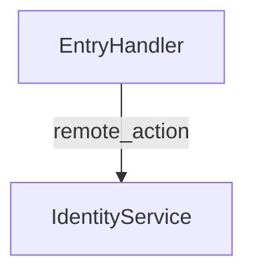

# @saptools/service-flow

`service-flow` is a standalone npm CLI for SAP CAP/CDS TypeScript workspaces made of many independent Git repositories. It statically indexes repositories, stores CAP facts in SQLite, links service-to-service calls across repository boundaries, and traces one exposed operation through handlers, helper packages, database access, remote OData calls, external HTTP calls, and async channels.

## Installation

```bash
npm install -g @saptools/service-flow
```

## Quick start

```bash
service-flow init /path/to/workspace
service-flow index --workspace /path/to/workspace
service-flow link --workspace /path/to/workspace
service-flow trace --workspace /path/to/workspace --repo facade-service --operation doWork
service-flow graph --workspace /path/to/workspace --service /FacadeService --path /doWork --format mermaid
service-flow doctor --workspace /path/to/workspace
```

## Phases

- **init** discovers nested Git repositories, creates `.service-flow/service-flow.db`, saves workspace configuration, and records repository metadata.
- **index** parses each repository independently. It extracts `package.json#cds.requires`, CDS services and operations, decorator handlers, handler registrations, service bindings, outbound calls, async topics, external HTTP calls, and local database queries.
- **link** resolves indexed calls after every repository has been indexed. It creates graph edges for resolved remote operations, helper package imports, dynamic candidates, async topics, local DB calls, external destinations, and unresolved calls.
- **trace** starts from a repository, service path, operation, operation path, or handler selector and renders table, JSON, or Mermaid output.

## Supported CAP patterns

The indexer supports CAP projects with `.cds` models, `@sap/cds` package metadata, `cds-routing-handlers` decorators, `cds.connect.to("alias")`, `remote.send({ method, path })`, `remote.send({ query })`, `cds.run(SELECT...)`, `cds.services.Service.operation()`, Event Mesh-style `emit`, `publish`, and `on`, Cloud SDK-style HTTP calls, generated constants, and thin service wrappers that import helper packages.

## Dynamic edges

Dynamic destinations and service paths are preserved as parameterized edges:

```text
destination: svc_${objectCode}_process
servicePath: /${objectType}ProcessService
operationPath: /getPaths
```

Pass runtime values during trace:

```bash
service-flow trace --repo facade-service --operation doWork --var objectCode=xx --var objectType=Thing
```

The trace shows both the parameterized evidence and the concrete value used for matching when a target operation exists.

## SQLite database location

By default, state is stored below the selected workspace:

```text
/path/to/workspace/.service-flow/service-flow.db
```

Use `service-flow init /path/to/workspace --db /custom/path/service-flow.db` to override it.

## Security and redaction

The tool stores static source evidence and expression summaries only. It does not execute applications and does not persist runtime payload bodies. Keys matching `authorization`, `cookie`, `token`, `secret`, `password`, `key`, or `credential` are redacted in persisted summaries and CLI output.

## Output examples

```text
Start: facade-service /FacadeService doWork

Step  Type                 From                                To                                  Evidence
1     local_db_query       facade-service:srv/functions/Entry  Entity: Template                    srv/functions/EntryHandler.ts:8
2     remote_action        facade-service:srv/functions/Entry  /IdentityService/resolveAccess      srv/functions/EntryHandler.ts:10
```

```json
{
  "start": {
    "repo": "facade-service",
    "servicePath": "/FacadeService",
    "operation": "doWork"
  },
  "nodes": [],
  "edges": [],
  "diagnostics": []
}
```



## Limitations

- Static analysis cannot know all runtime branches.
- Dynamic service names may need `--var` values.
- Unsupported custom frameworks may appear as unresolved edges.
- Parse failures are stored as diagnostics and reported by `service-flow doctor`.
- The analysis favors explainable evidence and confidence scores over speculative resolution.

## Troubleshooting

- Run `service-flow doctor --workspace /path/to/workspace` to inspect parse errors and unresolved diagnostics.
- Run `service-flow list repos --workspace /path/to/workspace` to confirm repository discovery.
- Run `service-flow list services --repo facade-service` and `service-flow list calls --repo facade-service` to inspect indexed facts.
- Use `service-flow clean --workspace /path/to/workspace --db-only` and re-run `init`, `index`, and `link` if the database becomes stale.
