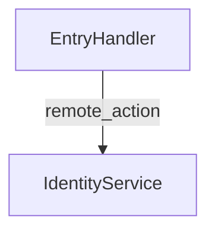

<div align="center">

# 🧭 `@saptools/service-flow`

**Trace SAP CAP service-to-service flows across multi-repository TypeScript workspaces.**

Index independent Git repositories, persist CAP/CDS facts in SQLite, resolve cross-repo service calls, and explain one operation end-to-end through handlers, helper packages, local database access, remote OData calls, external HTTP calls, and async channels — without running the applications.

[](https://www.npmjs.com/package/@saptools/service-flow)
[](./LICENSE)
[](https://nodejs.org)
[](https://packagephobia.com/result?p=@saptools/service-flow)
[](https://www.typescriptlang.org)

[Install](#-install) • [Quick Start](#-quick-start) • [CLI](#-cli) • [FAQ](#-faq)

</div>

---

## ✨ Features

- 🧭 **Cross-repository CAP tracing** — starts from a repo, service, operation path, operation name, or handler and follows the indexed flow across workspace boundaries
- 🧩 **Static CAP/CDS indexing** — extracts services, actions, functions, events, handler classes, decorator metadata, handler registrations, executable symbols, local helper calls, and package-level `cds.requires`
- 🔗 **Service-to-service linking** — resolves `cds.connect.to(...)`, `remote.send(...)`, `cds.services.*` style calls, helper package imports, dynamic candidates, and unresolved evidence into graph edges
- 🗄️ **SQLite-backed workspace cache** — stores deterministic facts under `.service-flow/service-flow.db` so large workspaces can be queried repeatedly without reparsing everything
- 🧠 **Dynamic edge support** — preserves parameterized destinations and service paths such as `svc_${objectCode}_process`, then lets trace and graph commands apply runtime `--var key=value` values or explicitly explore/infer bounded dynamic target candidates
- 📊 **Multiple output modes** — renders human-readable tables, authoritative detailed JSON, Mermaid diagrams, and versioned compact JSON for AI-oriented topology analysis
- 🩺 **Diagnostics-first workflow** — records parse/index issues and exposes them through `service-flow doctor` instead of hiding partial analysis
- 🧩 **CAP helper-aware binding evidence** — follows imported helpers exported directly or through named export lists and separates alias, destination, and service-path expressions for dynamic `cds.connect.to(alias, options)` calls
- 🧭 **Nested workspace discovery** — scans nested repositories even when the selected root is itself a valid Git repository, while ignoring empty `.git` placeholders
- 🔐 **Secret-aware summaries** — redacts sensitive keys in persisted summaries and CLI output while keeping useful source evidence
- 📦 **Standalone CLI & typed package** — ships as an npm CLI with TypeScript definitions for integration into other saptools workflows

---

## 📦 Install

```bash
# Global CLI
npm install -g @saptools/service-flow

# Or as a dependency
npm install @saptools/service-flow
# pnpm add @saptools/service-flow
# yarn add @saptools/service-flow
```

> [!NOTE]
> Requires **Node.js ≥ 24.0.0** for the bundled `node:sqlite` runtime. The CLI uses a persistent SQLite driver (`node:sqlite` in supported Node builds) for bound parameters, transactions, WAL, busy timeouts, and read-only query commands. The analyzer is static: it reads files and package metadata, but it does not start CAP services, connect to SAP BTP, or execute application code.

---


### Correctness notes

- Runtime `--var` values are considered for dynamic remote targets and template event names. Placeholder keys are the full trimmed expression inside a balanced `${...}` region, so keys such as `domainInfo.serviceName`, `tenantInfo.region?.toLowerCase()`, and `items?.[0].service` can be supplied literally without JavaScript evaluation. Quote complex keys in the shell, for example `--var 'tenantInfo.region?.toLowerCase()=lookup'`. Local database, external HTTP, and already resolved static edges keep their persisted status, target, reason, and confidence. Partial substitutions remain dynamic and report the missing placeholder names.
- `trace` and `graph` both accept repeatable `--var key=value` options. Effective substitutions are rendered in trace evidence without mutating the persisted graph. Confidence values are bounded to `[0, 1]`.
- Contextual binding attempts retain a labelled `contextualPreSubstitutionState` for auditability. After compatible `--var` substitution, a dynamic edge, `effectiveResolution`, and `linker.reason` use the same sorted current missing-key message. Structural contextual blockers remain separately visible as `contextualBlocker`; they cannot be inferred away.
- Dynamic target exploration is explicit. Default `--dynamic-mode strict` keeps every target with unresolved runtime variables fail-closed, but diagnostics can provide complete copyable `--var` sets. `--dynamic-mode candidates` renders only viable, capped, explicitly unselected branches while the route remains unresolved, never enters their handler bodies, and adds no exploratory branch once complete explicit values resolve the route. `--dynamic-mode infer` traverses only when the top viable, complete candidate scores at least `0.85` and exceeds the runner-up by more than `0.05`; exact ties, candidates exactly on the margin, conflicts, duplicate identities, incomplete leaders, and weaker scores stay unresolved.
- Explicit variables are applied before candidate ranking. When a call has one selected binding, its original service-path, alias, and destination templates are matched against each concrete candidate before any repository-wide fallback; a package-level require is considered only when its alias matches that binding in the same caller repository. A conflict between a supplied value and a value derived from one of those validated signals rejects the candidate and yields `no_candidate_after_runtime_substitution` rather than a resolver-only target.
- Identity fallback removes an npm scope, splits camel case, lowercases, folds non-alphanumeric separator runs to `_`, and trims edge separators. It requires the complete normalized concrete route-owner package basename or repository name to match one placeholder with literal prefix and suffix, a resolved implementation for that effective operation, and workspace-wide unique identity/value evidence. A helper-owned implementation is valid evidence for an inherited operation, but helper and base-model names are never used as route identity. It never uses substrings, duplicate names, or discovery order. Generated commands shell-quote expression keys and values when required.
- `--max-dynamic-candidates` bounds candidate branches, viable and rejected suggestions, variable sets, nested derivation/conflict evidence, and projected persisted candidate arrays in table and detailed JSON output. Link-time and doctor candidate-like arrays carry stable total/shown/omitted metadata; canonical SQLite facts, rather than a displayed prefix, remain the source for trace inference and implementation hints. `omittedCandidateCount` means omitted **viable** candidates; rejected candidates have separate total, shown, and omitted counts.
- Repository selectors on list, trace, graph, and inspect commands narrow scope by workspace and exact repository ID. Unknown selectors return empty machine-readable diagnostics instead of falling back to another workspace or the whole database.
- Helper-package dependency edges prefer exact indexed package names. Duplicate package-name candidates are persisted as ambiguous evidence rather than silently selecting one repository.
- Handler registration parsing is AST-based for common `createCombinedHandler({ handler: ... })` forms: direct arrays, arrays assembled with spreads, non-`handlers` array names, aliased class imports, default-imported arrays, named exported arrays, and safe relative re-exports. Class-level rows keep registration file/line and import evidence.
- Zero-argument CAP lifecycle method decorators in the supported `OnCreate/Read/Update/Delete`, `Before*`, and `After*` families are indexed only with runtime (not type-only) handler/import evidence. Nonzero arguments, missing bodies, and unsupported shapes remain non-executable with raw resolution evidence. Lifecycle phase, event, canonical decorator, and source location remain distinct from CDS action/function implementation evidence. A known handler with no executable method reports `handler_methods_not_indexed`; a mixed class reports `handler_decorators_not_indexed` while its supported methods remain traceable.
- Implementation edges require both operation compatibility and registration evidence. Decorator operation signals are stronger than method-name fallback; common generated names such as `FuncGetConfiguration` and `ActionGetConfiguration` are normalized before comparison, and a contradictory decorator rejects the candidate even when the TypeScript method name collides. Same-repository registrations do not need a self-dependency edge; cross-package matches use registration or handler-package dependencies on the model package. Duplicate strong candidates are stored as ambiguous implementation edges.
- A resolved implementation edge exposes `selectedHandler` with the selected method id, class, method, repository, file, line, and accepted status. This provenance is cross-checked with the graph target before table output uses it. Candidate `rank` remains the raw discovery order; `displayRank` is selection-aware, and bounded rendering preserves that established order. Ambiguous and unresolved implementation edges have no selected handler provenance.
- Traces render persisted `OPERATION_IMPLEMENTED_BY_HANDLER` hops after static or runtime remote operation resolution, including terminal handler nodes and ambiguous or unresolved implementation evidence when traversal cannot continue.
- Repository fingerprints include source content, package name/version, dependencies and devDependencies, scripts, normalized `cds.requires` (including nested credentials), package file content, and the analyzer version. Metadata-only changes therefore trigger reindexing.
- Index publication is designed around the last-good snapshot: failed parse or persistence attempts are recorded as diagnostics and must not be mixed with older graph facts. After indexing changes, relink before relying on graph/trace output; doctor reports stale or inconsistent stores where detectable.
- Source discovery, file reads, hashing, parsing, and publication are all inside the repository-level protected indexing flow. A failed read keeps the previous fingerprint and facts, marks the repository failed, and records a `source_read_failed` diagnostic; a later successful index clears superseded read-failure diagnostics during fact publication.
- Index preparation remains deterministic and sequential. Each source file and `package.json` is read once into a repository-scoped immutable snapshot, and all TypeScript parser entrypoints share one lazy AST for that file. Publication uses one savepoint per repository inside the workspace consistency transaction: an invalid prepared snapshot rolls back and diagnoses only that repository, while the final package-invalidation/materialization pass remains workspace-atomic.
- Index writers are coordinated per SQLite database with a short atomic claim. A second writer fails with `index_writer_active`; a claim that remains SQLite-locked past the bounded wait reports `index_writer_coordination_failed`. A dead owner or sufficiently old legacy ownerless row is reconciled before a new claim. `clean`, including `--db-only`, uses the same claim and removes only exact SQLite sidecar files. Normal failures finalize their run row, while read-only list, trace, inspect, and doctor commands remain usable whenever the short publication transaction is not active.
- Normal successful database commands on supported Node 24 runtimes suppress the known `node:sqlite` experimental warning so JSON stdout remains parseable and stderr-clean. Real service-flow errors still use stderr and non-zero exit codes.
- Doctor treats a `running` index run as abandoned only after 60 minutes and includes the run id/start time. Active short-lived concurrent runs are not default warnings.
- Fresh databases include foreign keys for key graph, run, and diagnostic tables. Migrated legacy stores that still lack that metadata are reported by doctor with `legacy_schema_weaker_foreign_keys`; rebuild into a fresh database if strict structural parity is required.
- Parser warnings describe analysis completeness, while routing status describes graph behavior. A terminal DB edge can remain terminal while still exposing parser warning evidence about an unknown entity.
- Persisted graph rows take precedence during `trace` and `graph`: resolved call edges keep their `graph_edges.id`, `outbound_calls.id`, call-site file/line, outbound parser evidence, linker status/reason, and selected target evidence. Contextual runtime resolution can enrich evidence but does not replace an already resolved persisted target. Terminal start diagnostics such as ambiguous operations or rejected implementations return zero nodes and zero edges by default; candidates remain in structured diagnostics for automation.
- Every AST-backed call owner is selected from executable symbols by complete zero-based, half-open UTF-16 span containment. Event subscriptions and their handler references prefer the exact same-span synthetic `event_registration`; otherwise the narrowest containing scope and a fixed binary kind/name order apply. Physical line remains display evidence and is never an identity fallback.
- Event-subscription handler facts have the durable role `event_subscribe_handler`, retain `factOrigin: event_subscribe_handler_reference`, and keep resolver-owned `candidateStrategy` separate. Every supported subscription records one closed `handlerReferenceStatus`; named/member/namespace and supported single-wrapper references require one same-span role row, while explicitly unsupported inline/wrapper/reference shapes and a missing argument require none.
- Event-shaped calls are never discarded because a receiver proof is unavailable. The parser structurally proves CAP-connect declarations and reaching assignments, including later assignment, destructuring, try-wrapped assignment, and formatter-split chains. Property/parameter propagation and known non-CAP values remain typed, non-traversable facts; historical receiver names are retained only as explicit `name_fallback` evidence.
- Stable string consts, enum members, and const-object properties can supply static event names from the same file, an exact relative module, or a uniquely proven package public entry. Computed access, mutable or non-string members, hidden/duplicate containers, incomplete public surfaces, and unsupported alias chains fail closed with constant-specific reasons.
- Event names supplied as template literals are persisted as opaque, non-evaluated expressions instead of being dropped. Strict traces keep them dynamic until every exact emit- and subscribe-side placeholder key is supplied with `--var`; only equal, case-sensitive substituted names traverse the subscriber boundary. A canonical positional hole key may resolve different source-variable names on both sides.
- Equal template skeletons can appear under `--dynamic-mode candidates` as `EVENT_SHAPE_CANDIDATE_SUBSCRIBER` edges only when their hole layout is identical and at least one literal span is eight characters or longer. These bounded edges are always dynamic and non-authoritative; all-hole and short-literal shapes are refused.
- Repository environment declarations are allowlisted facts. The schema-14 analyzer reads only `SHARD_CODE` from `nodemon.json`, `.env`, `manifest.yml`, and `mta.yaml`, retains dev/deployment provenance, and supports only `toUpperCase()`/`toLowerCase()`. Duplicate consumer values, conflicting declarations, and unsupported transforms remain ambiguous or unresolved; adjacent non-allowlisted keys are never persisted.
- A subscription and its handler reference associate only by workspace, repository, normalized source file, and the complete non-null outer `.on(...)` call span, with matching line/caller validation. Link never falls back to caller, line, start offset, label, or case-folded name heuristics. Resolved, ambiguous, unresolved, and explicitly unsupported associations remain distinguishable.
- Service bindings carry their own declaration/assignment span and `owned_exact` or `ownerless_file_scope` status. Supported calls carry the exact visible binding site and a complete outer-to-inner lexical-scope proof capped at 16 scopes; persistence joins by repository, file, variable, and full site span. A deeper proof fails closed instead of being truncated. Shadowed, future, branch-dependent, hoisted, ambiguous, or otherwise unsupported flows remain unselected rather than using same-line/source-order proximity.
- Package symbol calls preserve module origin, ESM/CommonJS binding shape, local and imported names, requested package, and requested public subpath. Resolution requires a unique package repository plus a complete public-entry/name exposure proof and an executable body. An explicit `exports` map is authoritative; unsupported conditional/wildcard maps, unsupported or ambiguous entrypoints/barrels, unexposed internals, wrong subpaths, declaration-only targets, duplicate repositories/targets, incomplete retained evidence, mutable/reassigned/escaped public values, and mutated CommonJS namespace objects fail closed rather than selecting a stale body. Incomplete exact-scope evidence uses `public_surface_evidence_incomplete`; this conservative compatibility cost is intentional for package shapes the static analyzer cannot prove.
- One-hop derived import calls retain the import and target-declaration identities separately. Relative default-class instances resolve only when the exact requested module contains the matching declared class method and marks that class as the default export; package-derived members never fall through to a coincidental same-file name. A relative object shorthand that points onward to a package stays visibly unsupported, and every unresolved or ambiguous symbol-call fact is rendered as a non-traversable trace edge.
- Structural `cds.run` recognition is insensitive to source-line formatting. Query evidence records `hasForUpdate: true` when the proven fluent CQL chain contains `.forUpdate(...)`, without inspecting or retaining the lock argument.
- A local deterministic helper may contribute a service binding through one direct return of `cds.connect.to(...)` or `cds.connect.messaging(...)`, including a try block whose catch only logs and swallows the error. The evidence strategy is `single_hop_helper_return`; branching, a returning/connect-producing catch or finally block, and second-hop helpers remain fail-closed.
- Repository public-surface evidence uses the versioned `service-flow/package-public-surface@1` carrier and retains at most 256 public exposure records with truthful total/shown/omitted metadata. A displayed prefix never proves uniqueness or absence; an omitted requested scope stays unresolved unless an authoritative exact-name count proves the decision.
- OData entity paths are conservative terminal remote entity edges. Reads, mutations, deletes, navigation paths, media-stream paths such as `/Documents(ID)/content`, and uppercase unknown entity-set candidates do not inflate unresolved operation counts. Lowercase action/function-style paths remain eligible for indexed operation resolution.
- External HTTP destinations are static only when a safe literal or local const literal proves the value. Identifier, property-read, function-call, and arbitrary destination expressions are dynamic with stable `destination:dynamic:<hash>` ids and neutral labels; conditional literal branches expose only safe candidate names.
- Schema version 14 adds canonical event-skeleton columns, a repository environment-declaration carrier, and generated string-constant facts/indexes. A writer-only migration leaves every legacy skeleton/environment value null, marks indexed repositories stale with `schema_v14_event_surface_requires_reindex`, and never fabricates provenance. Package `0.1.72` uses analyzer `0.1.71-facts.1`; read-only commands report bounded schema/reindex diagnostics and link preserves the last good graph until migration, force reindex, and force relink succeed.


## 🚀 Quick Start

```bash
# 1. Initialize a workspace that contains many CAP/helper Git repositories
service-flow init /path/to/workspace

# 2. Index source facts from every discovered repository
service-flow index --workspace /path/to/workspace

# 3. Resolve cross-repository edges after all repos have been indexed
service-flow link --workspace /path/to/workspace

# 4. Trace one operation as a readable table
service-flow trace --workspace /path/to/workspace --repo facade-service --operation doWork

# 5. Generate a Mermaid diagram for documentation
service-flow graph --workspace /path/to/workspace --service /FacadeService --path /doWork --format mermaid

# 6. Check parse/index diagnostics
service-flow doctor --workspace /path/to/workspace
```

After `init`, the workspace configuration and SQLite database live below the selected workspace by default. Run `index` whenever source changes; unchanged repositories are skipped unless `--force` is supplied. Then run `link` to rebuild the graph edges used by `trace` and `graph`.

> [!IMPORTANT]
> The schema-14 fact release upgrades the database and uses analyzer `0.1.71-facts.1`. Event receiver, constant, skeleton, and environment semantics changed, so every existing workspace requires:
>
> ```bash
> service-flow index --workspace /path/to/workspace --force
> service-flow link --workspace /path/to/workspace --force
> ```
>
> Link refuses stale or incompletely reindexed facts before deleting the previous graph. Package/CLI version, SQLite schema version, and analyzer compatibility version are independent contracts; a later output-only package patch can keep the same analyzer version without forcing another reindex.

---

## 🧰 CLI

### 🏁 `service-flow init <workspace>`

Discover nested Git repositories, create workspace state, save configuration, and record repository metadata.

```bash
service-flow init /path/to/workspace
service-flow init /path/to/workspace --db /custom/path/service-flow.db
service-flow init /path/to/workspace --ignore node_modules dist coverage .git
```

| Flag | Description |
| --- | --- |
| `--db <path>` | Store the SQLite database at a custom path instead of `<workspace>/.service-flow/service-flow.db` |
| `--ignore <pattern...>` | Override the default discovery ignore patterns |

### 🔎 `service-flow index`

Parse repository files and persist CAP facts. Use `--repo` for a focused refresh or `--force` when you want to re-index unchanged files.

```bash
service-flow index --workspace /path/to/workspace
service-flow index --workspace /path/to/workspace --repo facade-service
service-flow index --workspace /path/to/workspace --repo identity-service --force
```

| Flag | Description |
| --- | --- |
| `--workspace <path>` | Workspace root or a path that can load the saved workspace configuration |
| `--repo <name>` | Index only one repository by discovered repository name |
| `--force` | Re-index even when file hashes indicate nothing changed |

### 🔗 `service-flow link`

Resolve indexed outbound calls after repositories have been indexed. This rebuilds the `graph_edges` table for the workspace. The summary separates remote operation calls resolved, local operation calls resolved, unresolved operation calls, ambiguous operation calls, dynamic operation calls, terminal call edges, and resolved/ambiguous/unresolved/missing event-subscription handler associations. Each subscription creates one `EVENT_SUBSCRIPTION_HANDLED_BY` edge; emit sites do not multiply that persisted cardinality.

```bash
service-flow link --workspace /path/to/workspace
service-flow link --workspace /path/to/workspace --force
```

| Flag | Description |
| --- | --- |
| `--workspace <path>` | Workspace to link |
| `--force` | Accepted for workflow symmetry; linking always rebuilds graph edges |

### Pipeline-safe output

Normal command output is safe to pipe to a Unix consumer that intentionally stops reading early. A closed stdout pipe stops further output without an unhandled `EPIPE` stack trace; unrelated stdout failures still use the normal stderr diagnostic and non-zero exit outcome. Complete detailed JSON, compact JSON, table, and Mermaid output bytes follow the same stdout policy.

Trace and graph validate `--format` before opening the database. An unknown value writes a clear error to stderr, emits no stdout, and exits non-zero instead of silently falling back to a different format.

### 🧵 `service-flow trace`

Trace one starting point and render table, detailed JSON, compact JSON, or Mermaid output. Trace
walks linked `graph_edges`, so a resolved remote operation is followed into the
target handler up to `--depth` instead of showing only calls in the first file.

With `--include-async`, an emitted event is matched by its exact, case-sensitive raw name to every current-generation subscription in the same indexed workspace. Each registration produces a bridge to its resolved handler, and each distinct handler scope is expanded at most once for the same evaluation context. Duplicate registrations therefore remain visible without duplicating the handler body. A bridge is still rendered at the depth boundary, but its handler body is not expanded; structural self-cycles and mutual event cycles are rendered and stopped deterministically. Subscriber evaluation begins with an empty binding/payload context. This is a workspace-wide static name inference, not proof that a runtime broker, channel, tenant, ordering rule, payload, or deployed application will deliver an event. A subscribe call never reverse-triggers emitters, and `includeAsync=false` neither follows event bridges nor treats event-handler references as ordinary synchronous calls.

### Symbol-scoped helper traversal

`service-flow trace` starts from the selected handler method symbol, renders outbound calls owned by that symbol, and follows conservative local helper-call facts. Handler helper properties such as `helper = async () => { ... }` and `helper = function () { ... }` are indexed as `ClassName.helper`; top-level CAP lifecycle, route, and event callbacks receive synthetic `module:<file>#callback:<line>` owners only when their body contains a supported outbound call or event subscription. Supported helper edges include same-file functions, `this.method()` calls, and exactly mapped relative imports/exports that resolve to an indexed executable symbol. Proxy-member calls keep factory/import evidence and avoid resolving by repository-wide member name alone when the target is ambiguous. Calls from unrelated functions in the same source file are not included merely because the file path matches.

Local CAP calls through `cds.services.<Service>.<operation>()`, bracket service lookups, and simple aliases are indexed as local operation calls. Linking first stays within the same repository and matches the target operation by exact qualified CDS service name, exact simple service name, exact service path, or an unambiguous service-path suffix. If no same-repository service exists, the linker can use implementation-context evidence to resolve model-package operations for helper packages: a resolved/ambiguous implementation candidate, registration package, or dependency/import edge must tie the caller repository to the model operation. Name-only global matches are preserved as unresolved candidate evidence rather than guessed links. Entity accessors such as `cds.services.db.entities(...)` are treated as entity metadata access, not operation calls.

Conservative local symbol traversal intentionally excludes decorators, built-ins such as `JSON.parse`, collection methods, third-party APIs, and arbitrary property chains unless the callee can plausibly resolve to an indexed local symbol. Named export lists such as `export { loadTemplate as publicLoadTemplate }` are indexed with the public exported name so relative imports can resolve. One-level object-literal helpers are indexed as symbols named like `cacheHelper.getConfiguration`; nested object literals are not yet expanded beyond the first helper level. `parseGeneratedConstants` remains a public low-level parser export for callers that need it, but generated constants are not persisted as graph facts in this patch; linking uses the deterministic decorator normalizer described above.
Detailed JSON output includes typed nodes for calls, operations, database entities,
external destinations, and unresolved/dynamic candidates when edges exist. Chained CAP DB queries inside `cds.run(...)` and direct supported builders are parsed with TypeScript AST evidence for `SELECT`, `INSERT`, `UPSERT`, `UPDATE`, and `DELETE` forms. A direct builder needs both a recognized CAP root and a proven execution context: direct `await`, return from an `async` or syntactically guaranteed-Promise callable, or a static element of awaited `Promise.all([...])`. Plain query factories and unrelated methods named `from`, `where`, or `set` are not promoted to database facts. When the query target is genuinely dynamic, graph status remains terminal and JSON retains `parserWarning` evidence, while table and Mermaid render the target as `Entity: unknown` rather than a numeric call id.

```bash
service-flow trace --workspace /path/to/workspace --repo facade-service --operation doWork
service-flow trace --workspace /path/to/workspace --service /FacadeService --path /doWork --format json
service-flow trace --workspace /path/to/workspace --service /FacadeService --path /doWork --include-async --format compact-json
service-flow trace --workspace /path/to/workspace --handler EntryHandler --depth 1 --format json
service-flow trace --workspace /path/to/workspace --service /FacadeService --path /doWork --depth 2
service-flow trace --workspace /path/to/workspace --repo facade-service --operation doWork --var objectCode=xx --var objectType=Thing
service-flow trace --workspace /path/to/workspace --repo facade-service --operation doWork --dynamic-mode candidates --max-dynamic-candidates 20
service-flow trace --workspace /path/to/workspace --service /FacadeService --path /doWork --implementation-hint service=/TargetService,operation=/runTask,repo=target-helper
```

| Flag | Description |
| --- | --- |
| `--workspace <path>` | Workspace to read |
| `--repo <name>` | Start from a repository |
| `--operation <name>` | Start from an operation/action/function name |
| `--service <path>` | Start from a CAP service path such as `/FacadeService` |
| `--path <operationPath>` | Start from an operation path such as `/doWork` |
| `--handler <name>` | Start from a handler class or handler-like selector |
| `--depth <n>` | Maximum executable/service scope depth; defaults to `25`. Implementation hops are rendered at the current scope depth, while downstream handler bodies consume the next depth. The `step` field never exceeds the requested depth. |
| `--format <format>` | Exactly `table`, `json`, `mermaid`, or `compact-json`; defaults to `table` |
| `--include-external` | Include external HTTP/destination edges in traversal output |
| `--include-db` | Include local DB query edges in traversal output |
| `--include-async` | Include async publish/subscribe edges in traversal output |
| `--implementation-repo <name>` | Select one implementation repository for every ambiguous hop; retained for backward compatibility |
| `--implementation-hint <scope>` | Select one implementation for a matching hop; repeatable fields are `service`, `operation`, `package`, `repository`, `family`, and required `repo` |
| `--var <key=value>` | Apply runtime values to dynamic destinations/service paths; repeatable |
| `--dynamic-mode <mode>` | `strict`, `candidates`, or `infer`; defaults to `strict` |
| `--max-dynamic-candidates <n>` | Cap viable/rejected suggestions, exploratory branches, variable sets, and nested candidate evidence; defaults to `5` |

### 🗺️ `service-flow graph`

Render a deeper architecture graph from the same selector model used by `trace`. Graph output includes DB, async, and external edges by default and uses depth `100`.

```bash
service-flow graph --workspace /path/to/workspace --service /FacadeService --path /doWork
service-flow graph --workspace /path/to/workspace --repo facade-service --operation doWork --format json
service-flow graph --workspace /path/to/workspace --repo facade-service --operation doWork --format compact-json
```

| Flag | Description |
| --- | --- |
| `--workspace <path>` | Workspace to read |
| `--repo <name>` | Filter/start by repository |
| `--operation <name>` | Filter/start by operation name |
| `--service <path>` | Filter/start by service path |
| `--path <operationPath>` | Filter/start by operation path |
| `--format <format>` | Exactly `mermaid`, `json`, or `compact-json`; defaults to `mermaid` |
| `--implementation-repo <name>` | Select one implementation repository for every ambiguous hop |
| `--implementation-hint <scope>` | Apply a repeatable scoped implementation selection |
| `--var <key=value>` | Apply repeatable runtime substitutions |
| `--dynamic-mode <mode>` | `strict`, `candidates`, or `infer`; defaults to `strict` |
| `--max-dynamic-candidates <n>` | Cap viable/rejected suggestions, exploratory branches, variable sets, and nested candidate evidence; defaults to `5` |

### 📚 `service-flow list ...`

Inspect indexed facts as JSON.

```bash
service-flow list repos --workspace /path/to/workspace
service-flow list services --workspace /path/to/workspace --repo facade-service
service-flow list operations --workspace /path/to/workspace --repo facade-service --service /FacadeService
service-flow list calls --workspace /path/to/workspace --repo facade-service --operation doWork
# `--operation` filters outgoing call paths/payloads; use trace/graph `--operation` for handler-origin traversal.
```

| Command | Description |
| --- | --- |
| `list repos` | Print discovered repositories with kind and package name |
| `list services` | Print indexed CDS services, optionally filtered by repo |
| `list operations` | Print indexed actions/functions/events, optionally filtered by repo and service |
| `list calls` | Print indexed outbound calls, optionally filtered by repo and operation/path |

### Operation selector resolution

Operation-based trace starts first resolve indexed CDS operations, then follow the persisted `OPERATION_IMPLEMENTED_BY_HANDLER` graph edge to the exact handler method symbol. Generated decorator constants such as `ActionPublishRecord.name` and `FuncLookupRecord.name`, local string constants, string enum members, and const-object string properties are normalized with structured resolution evidence. Unsupported decorator expressions remain visible and do not contradict a matching method name. If the same operation name exists in multiple services or repositories, `service-flow` returns `trace_start_ambiguous` with copyable `--service <path> --path <operation-path>` selectors; add `--repo` when repository scope is also ambiguous. Unique operation selectors emit the initial operation node and implementation hop exactly once before traversing handler-owned calls.

Ambiguous operation starts include repository, service path, operation path, source file, and source line candidates. When service paths are unique, JSON diagnostics also include copyable `--service <path>` suggestions. A scoped implementation hint changes only the matching implementation hop; guided traversal uses the selected handler repository even when the operation model belongs to another repository.

### External HTTP targets

External HTTP facts use semantic terminal nodes instead of outbound-call row ids. Literal destinations render as `External destination: ANALYTICS_API`; static absolute or relative URLs render as redacted `External endpoint` labels; dynamic URL expressions render as `External endpoint: dynamic URL`; unavailable target evidence renders as `External endpoint: unknown`. URL user information, query-string values, credentials, tokens, cookies, headers, and payload bodies are not stored in labels. Run `service-flow link` after schema migration so legacy numeric targets are rebuilt from the current parser evidence. `service-flow doctor --strict` reports `strict_external_http_target_quality` with semantic, dynamic, unknown, numeric, and malformed-evidence counts.

## Troubleshooting resolution accuracy

- If a remote edge is unresolved, run `service-flow list calls --operation <name>`
  and `service-flow inspect operation <name>` to compare the captured call path
  with indexed CDS operations. Operation-path-only matches are shown as ambiguous/unresolved with candidate counts instead of high-confidence cross-repo links.
- Service bindings are matched to outbound calls only by the parser-carried
  repository, source file, variable name, and complete binding-site `[start,end)`
  identity, then validated against the complete lexical-scope proof. Line,
  nearest declaration, shared owner, and source-order proximity are never
  selection fallbacks. If a helper-returned client is
  not linked, export the helper from a relative import target and ensure it returns
  `cds.connect.to(...)` directly or returns an object property backed by a local
  connected-client variable. Supported helper shapes include function declarations,
  arrow-function variables, function-expression variables, named export lists, and
  aliased exports such as `export { connectCatalog as createCatalogClient }`.
  Shorthand returns like `return { client }` and explicit returns like
  `return { serviceClient: client }` are followed only when the returned value is
  a concrete client. Trace evidence includes the caller variable, returned
  property, imported helper, source file, exported symbol, placeholders, and
  transaction alias steps.
- Direct `SELECT.one.from(Entity)`, `SELECT.from(Entity)`,
  `INSERT.into(Entity)`, `UPSERT.into(Entity)`, `UPDATE(Entity)`, and
  `DELETE.from(Entity)` statements are indexed when directly awaited, returned
  by an `async` or guaranteed-Promise callable, or supplied as static elements
  to awaited `Promise.all([...])`; equivalent `cds.run(...)` queries retain
  their wrapper classification. Plain non-promise query factories stay out of
  local database facts.
- `doctor` reports silent quality problems such as services without operations,
  handler repositories without CDS service facts, and an empty search index.

### 🔬 `service-flow inspect ...`

Inspect raw indexed records for a repository or operation selector.

```bash
service-flow inspect repo facade-service --workspace /path/to/workspace
service-flow inspect operation doWork --workspace /path/to/workspace
service-flow inspect operation /doWork --workspace /path/to/workspace
```

| Command | Description |
| --- | --- |
| `inspect repo <name>` | Print one repository database record or `{ "error": "repo not found" }` |
| `inspect operation <selector>` | Print operations whose name or path equals the selector |

### 🩺 `service-flow doctor`

Print stored diagnostics. Default output suppresses high-noise entity-only service checks; `--strict` includes them. Without `--format`, doctor keeps the legacy-compatible behavior: JSON when diagnostics exist and `No diagnostics recorded` for a clean workspace. Deterministic JSON mode prints `[]` when clean.

```bash
service-flow doctor --workspace /path/to/workspace
service-flow doctor --workspace /path/to/workspace --strict
service-flow doctor --workspace /path/to/workspace --strict --detail
service-flow doctor --workspace /path/to/workspace --strict --format json
service-flow doctor --workspace /path/to/workspace --strict --format table
```

`--format json` always returns a JSON array, including `[]` for clean workspaces. `--format table` prints a concise human-readable table with capped copyable hint lines; use JSON when automation needs structured fields, then use a scoped selector or implementation hint for a precise follow-up. Omit `--format` when relying on the pre-0.1.48 compatible output contract.

Strict output keeps stable category, count, severity, and capped example fields. `--detail` adds useful fields but keeps candidate-like and example arrays capped; use the provided scoped selectors or implementation hints for a precise follow-up.

Strict binding diagnostics group remote sends into `direct_binding_missing`, `contextual_binding_recoverable`, `ambiguous_binding_candidates`, `unrecoverable_binding`, and `missing_symbol_parameter_metadata`. Candidate chains remain as bounded JSON projections with count metadata, while table output stays capped and copyable.

### 🧹 `service-flow clean`

Remove generated service-flow state.

```bash
service-flow clean --workspace /path/to/workspace --db-only
service-flow clean --workspace /path/to/workspace
```

| Flag | Description |
| --- | --- |
| `--db-only` | Remove only the configured SQLite database |
| *(default)* | Remove the marker-owned `.service-flow` state directory; custom/unowned or dangerous parent directories are refused |

---

## 🧱 What Gets Indexed

`service-flow` favors explainable static facts with source-file evidence and confidence scores.

| Area | Examples |
| --- | --- |
| Repository metadata | nested Git repos, package name/version, dependency graph, repository kind |
| CAP model facts | `.cds` services, service paths, actions, functions, events, parameters, return types |
| Handler facts | `cds-routing-handlers` decorators, handler classes/methods, server registrations |
| Service bindings | `cds.connect.to("alias")`, aliases from `package.json#cds.requires`, destination/service path expressions |
| Outbound calls | `remote.send({ method, path })`, `remote.send({ query })`, `cds.services.Service.operation()`, service wrapper calls |
| Local data access | directly executed CAP query builders, `cds.run(SELECT...)`, and local entity query evidence |
| Async channels | Event Mesh-style `emit`, `publish`, and `on` facts |
| External calls | Cloud SDK-style HTTP/destination calls and external edge evidence |
| Generated constants | low-level `parseGeneratedConstants` parser output for integrations; not persisted as first-class graph facts in this patch |

---

## 🧠 Dynamic Edges

Runtime-dependent destinations and paths are preserved as parameterized evidence instead of being discarded.

```text
destination: svc_${objectCode}_process
servicePath: /${objectType}ProcessService
operationPath: /getPaths
```

Pass runtime values during trace:

```bash
service-flow trace --workspace /path/to/workspace --repo facade-service --operation doWork --var objectCode=xx --var objectType=Thing
```

When a concrete target exists after variable substitution, the trace shows both the parameterized evidence and the resolved match. When it does not, `service-flow` keeps the edge as a dynamic candidate or unresolved edge so the missing link remains visible.

When runtime values are missing, strict trace output includes the missing variable names plus bounded candidate guidance when indexed operations and routing metadata can derive values. Detailed JSON includes `dynamicTargetExploration`, `dynamicTargetCandidates`, `dynamicTargetCandidateSuggestions`, `suggestedVarSets`, and `dynamicTargetInference`; compact JSON retains only allowlisted counts and missing variable names, while table output shows compact candidate counts and copyable `--var` examples. Use `--dynamic-mode candidates` to render capped exploratory branches, or `--dynamic-mode infer` to continue only through a unique fully-derived candidate.

Direct sends and same-file or imported wrappers share one path-candidate analysis. Literals and immutable aliases resolve; conditional or branch-assigned static alternatives remain ambiguous with bounded raw and normalized candidate projections plus counts; dynamic reassignments remain dynamic with the exact runtime identifier. Wrapper definition sends are treated as templates when a concrete caller-site edge can be indexed.

Service binding evidence distinguishes a directly persisted binding from caller-to-callee contextual recovery. A call with a selected binding uses that exact binding as its routing context, including helper-return provenance, rather than combining unrelated client definitions from the repository. When no binding is selected, fallback references remain marked as fallback; multiple distinct fallback bindings are not combined into one inferred route. Persisted binding selection never uses a declaration after the call and does not choose among different mutable client assignments. Contextual trace evidence carries caller and callee sites, argument/property and parameter/local names, original binding location, routing expressions, candidate ties, and selection status.

OData evidence preserves the raw path, query-free path, normalized invocation path, invocation arguments, placeholder keys, classifier reason, indexed operation candidate count, and entity-versus-operation precedence decision. Entity keys, navigation paths, media/property paths, and query reads remain entity access unless indexed operation evidence and strong service context prove an operation.

Service-binding evidence keeps these fields distinct: service alias, alias expression, destination expression, service-path expression, operation-path expression, and runtime placeholders. Helpers that return concrete connected clients inside object properties are followed through destructuring, simple identity aliases, transitive same-file aliases, and transaction aliases while preserving helper-chain evidence. This is important for common CAP helpers such as `cds.connect.to(`remote_${code}`, { credentials: { destination: `remote_${code}`, path: `/${entityType}ProcessService` } })`, where the alias is not the service path.

By default, production traces should be built from production source files. Keep generated credentials and local state out of git, and use explicit fixture/test workspaces when validating test-only mocked service clients so they do not pollute production graph interpretation.

---

## 📁 Workspace State

By default, state is stored below the selected workspace:

```text
/path/to/workspace/.service-flow/service-flow.db      # SQLite fact and graph database
/path/to/workspace/.service-flow/config.json          # saved workspace configuration
```

Use a custom database path when the workspace is read-only or when you want to keep generated state elsewhere:

```bash
service-flow init /path/to/workspace --db /custom/path/service-flow.db
```

> [!IMPORTANT]
> Generated state is derived from source code and may reveal internal repository names, service names, endpoints, entity names, and call paths. Do not commit `.service-flow/` or attach the database to public tickets.

---

## 🔐 Security & Redaction

- The analyzer reads static source files and package metadata only.
- It does **not** execute CAP services, load `.env` files, call SAP BTP, or connect to remote systems.
- Persisted summaries and CLI output redact keys that look like credentials, including `authorization`, `cookie`, `token`, `secret`, `password`, `key`, and `credential`.
- Payload bodies are summarized for traceability; runtime payload values are not required for indexing.
- Compact JSON is projected through a field-by-field allowlist. It omits raw parser/outbound evidence, candidate and score bodies, payloads, call arguments, helper-chain bodies, supplied variable values, and arbitrary diagnostic/remediation text. Query metadata contains supplied variable names only; `runtimeValuesOmitted` is always `true`, so exact replay requires the original supplied values retained by the caller.

---

## 📤 Output Examples

### Table

```text
Start: facade-service /FacadeService doWork

Step  Type                 From                                To                                  Evidence
1     local_db_query       facade-service:srv/functions/Entry  Entity: Template                    srv/functions/EntryHandler.ts:8
2     remote_action        facade-service:srv/functions/Entry  /IdentityService/resolveAccess      srv/functions/EntryHandler.ts:10
```

### Detailed JSON

`--format json` remains the complete, pretty-printed `TraceResult` and the authoritative audit artifact for raw evidence, candidate inspection, locations, and effective versus persisted decisions. It is intentionally large.

```json
{
  "start": {
    "repo": "facade-service",
    "servicePath": "/FacadeService",
    "operation": "doWork"
  },
  "nodes": [],
  "edges": [],
  "diagnostics": []
}
```

### Compact JSON

`--format compact-json` projects the same traversal into the minified, newline-terminated `service-flow/compact-graph@1` contract. It is a lossy AI-oriented semantic topology and bounded decision summary; use the detailed JSON companion whenever exact evidence is required.

```json
{"schema":"service-flow/compact-graph@1","start":{"repo":"facade-service","servicePath":"/FacadeService","operation":"doWork","operationPath":null,"handler":null},"query":{"depth":25,"includeAsync":true,"includeDb":true,"includeExternal":true,"dynamicMode":"strict","maxDynamicCandidates":5,"suppliedVariableNames":[],"runtimeValuesOmitted":true,"implementationRepo":null,"implementationHints":[]},"source":{"schemaVersion":14,"analyzerVersion":"0.1.71-facts.1","graphGeneration":7},"summary":{"completeness":"complete","fullTraceNodes":2,"fullTraceEdges":1,"fullTraceDiagnostics":0,"nodes":2,"edges":1,"collapsedEdges":0,"statusCounts":{"resolved":0,"terminal":1,"inferred":0,"dynamic":0,"ambiguous":0,"unresolved":0,"cycle":0},"projection":{"evidence":"summary-only","syntheticEndpoints":0,"omittedUnreferencedFullNodes":0}},"repos":["facade-service"],"files":["srv/EntryHandler.ts"],"nodeColumns":["id","kind","label","repo","file","line"],"nodes":[["n0","symbol","EntryHandler.doWork",0,0,8],["n1","database_entity","Template",null,null,null]],"edgeColumns":["id","traceOrdinals","step","type","from","to","status","confidence","count","details"],"edges":[["e0",[0],1,"local_db_query","n0","n1","terminal",0.95,1,null]],"diagnosticColumns":["fullDiagnosticIndex","severity","code","message","file","line","details"],"diagnostics":[]}
```

The `nodeColumns`, `edgeColumns`, and `diagnosticColumns` arrays define fixed-width tuples; absent cells are explicit `null`. Any breaking change to those columns or to the declared v1 top-level/query/source/summary/status/aggregation/diagnostic semantics requires a new `@N` schema. Repository and file dictionaries are sorted, and dense `n0...`/`e0...` IDs are assigned after canonical sorting. Those dense IDs are output-local and are not stable database identifiers.

Each compact edge's `traceOrdinals` contains the zero-based detailed edge index or indexes from the exact corresponding trace invocation. Aggregated equivalent observations retain their multiplicity in `count` and their complete sorted ordinal list. These ordinals are valid only for the same database generation, selector, traversal options, implementation hints, and runtime inputs. Bounded `details.refs` can also carry graph, call, operation, symbol, or handler IDs for exact drill-down in the declared `source.graphGeneration`; those database references are generation-scoped rather than long-lived IDs.

The edge tuple's `status` and `to` cells are the canonical effective decision. Optional `details.decision.effectiveResolutionStatus` and `effectiveTarget` are omitted only when they were derived from those exact same canonical values; label equality is insufficient. Differing persisted status/target decisions, counts, reason codes, and references remain. Each reference group retains at most 5 values with `total`, `shown`, and `omitted`; missing-variable projection retains at most 8 safe names, each at most 160 UTF-16 code units.

An ambiguous implementation decision with more than one candidate may include `tiedCandidateRepos` only when more than one uniquely attributable repository exists. Compact start diagnostics may likewise include bounded `selectorSuggestions`, a short `selectorKind`, or bounded `invalidFactCategories`. Each of these optional reference groups uses the same 5-value cap and truthful `total`/`shown`/`omitted` counts. They contain only allowlisted codes or safe identifiers; detailed JSON remains authoritative for full candidate and lifecycle evidence. Implementation-hint remediation lists the accepted `service`, `operation`, `package`, `repository`, `family`, and required `repo` keys.

Detailed/runtime artifacts retain the arbitrary full trimmed placeholder key. Compact output accepts an ASCII identifier (`[A-Za-z_$][A-Za-z0-9_$]*`), followed by zero or more direct/optional ASCII identifier members or non-negative decimal numeric element accesses, and optionally one final zero-argument `toLowerCase`, `toUpperCase`, or `trim` transform. Raw control characters are rejected before surrounding-space normalization, so a leading or trailing control cannot be trimmed into a displayable name. Unsafe or overlong keys remain counted in `missingVariableCount` and `omittedMissingVariableCount` and are available through the correlated detailed edge/diagnostic; compact never executes or partially evaluates them.

`source.analyzerVersion` is the one persisted analyzer value for the selected scope. It is `none` when no repositories exist, `mixed` when multiple analyzer versions are present, and `legacy_unknown` when the persisted value is absent. Reindex before relying on topology whenever the source reports a sentinel rather than the current analyzer.

For identical database state and inputs, canonical dictionaries, semantic endpoints, aggregation, and ordering make compact output byte-deterministic. Database rebuilds can legitimately change graph generation, trace ordinals, and generation-scoped references, so byte identity is not promised across arbitrary rebuilds. Representative large traces are regression-tested against both pretty and minified detailed JSON size budgets; compact output does not achieve this by weakening detailed JSON.

Write the compact graph and its detailed audit companion through ordinary stdout redirection:

```bash
service-flow graph \
  --workspace /path/to/workspace \
  --repo facade-service \
  --service /FacadeService \
  --operation doWork \
  --format compact-json > order-flow.graph.json

service-flow graph \
  --workspace /path/to/workspace \
  --repo facade-service \
  --service /FacadeService \
  --operation doWork \
  --format json > order-flow.trace.json
```

### Mermaid


```mermaid
flowchart TD
  EntryHandler -->|remote_action| IdentityService
```

---

## ⚠️ Limitations

- Static analysis cannot know every runtime branch, feature flag, or environment-specific destination.
- Exact event-name matching is a workspace-scoped static inference. It does not establish broker, destination, channel, tenant, payload compatibility, ordering, deployment, or runtime delivery.
- Dynamic service names and paths may need `--var key=value` values to resolve concrete targets.
- OData path punctuation is structural only outside balanced opaque placeholders and quoted values. A top-level query after a placeholder remains a query, while `?`, `/`, or parentheses inside its expression do not classify the path. A placeholder overlapping the first classification head remains runtime-dependent until exact substitution and indexed evidence prove the target.
- Highly customized frameworks can still appear as unresolved edges until parser support is added.
- Parse failures are stored as diagnostics and reported by `service-flow doctor`.
- The resolver prefers source evidence and confidence scores over speculative matches.

---

## ❓ FAQ

<details>
<summary><b>Does service-flow run my CAP application?</b></summary>

No. It is a static analyzer. It reads source files, `.cds` models, `package.json`, and TypeScript AST information, then stores derived facts in SQLite.

</details>

<details>
<summary><b>When should I run index and link again?</b></summary>

Run `service-flow index` after source, CDS, package metadata, or helper-package code changes. Run `service-flow link` after indexing so cross-repository edges are rebuilt from the latest facts.

</details>

<details>
<summary><b>Why is an expected call unresolved?</b></summary>

Check `service-flow doctor`, then inspect the facts with `service-flow list services`, `service-flow list operations`, and `service-flow list calls`. Dynamic destinations may need `--var key=value`; the key is the full trimmed expression inside `${...}` and is matched literally without JavaScript evaluation. Operation-path-only ambiguous remote actions usually mean the call had no service binding id; same-file identity aliases are propagated, while property/call-expression aliases and ambiguous wrapper flows remain conservative; inspect `list calls`, `inspect operation`, and `doctor --strict` to determine whether helper-return propagation or wrapper support is missing. Contextual implementation selection only continues into a handler when static evidence such as caller repository, resolved service path, destination/alias expression, dependency edges, registration package, and local service ownership makes exactly one candidate stronger; ties remain ambiguous with reasons.
Default doctor output is intended to focus on actionable indexing or trace-impacting issues; use `--strict` when you need exhaustive model-shape diagnostics for entity-only or extension-heavy CDS models. Strict mode also reports normalized OData invocation ambiguity, remote-action target quality, likely missed identity aliases, no-binding remote actions, contextual implementation stops, and wrapper dynamic-path candidates, including whether unresolved unknown/dynamic paths are semantic instead of numeric call ids. GET OData entity/query reads such as `/Books?$filter=contains(title,'A')`, `/Books(ID='1000')`, and navigation queries are terminal remote query/entity edges unless strong indexed CDS operation evidence resolves them; placeholders inside query strings are preserved as query evidence rather than dynamic operation selectors.

</details>

<details>
<summary><b>Is the SQLite database safe to commit?</b></summary>

No. It should not contain runtime secrets by design, but it can expose internal topology, service names, paths, repository names, and source evidence. Keep `.service-flow/` out of git.

</details>

---

## 🛠️ Development

From the monorepo root:

```bash
pnpm install
pnpm --filter @saptools/service-flow build
pnpm --filter @saptools/service-flow typecheck
pnpm --filter @saptools/service-flow lint
pnpm --filter @saptools/service-flow test:unit
pnpm --filter @saptools/service-flow test:e2e
```

The e2e tests use fixture CAP workspaces and fake-backed flows. They do not need live SAP BTP credentials.

---

## 📄 License

MIT

---

Made with ❤️ to make your work life easier!
